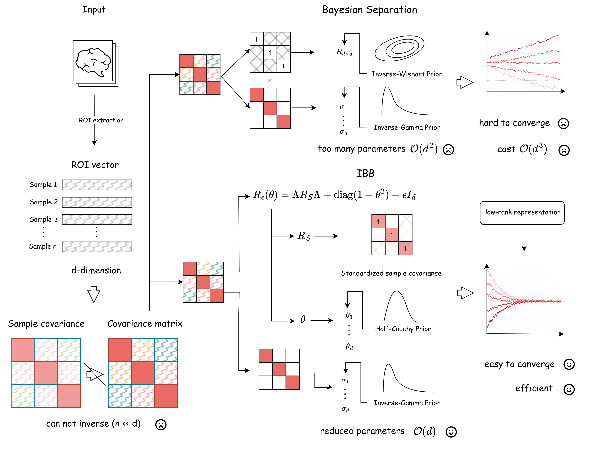

<div align="center">

# 🧠 IBB

### Information-Borrowing Bayesian covariance estimation

**Estimating a population covariance matrix when the number of variables far exceeds the number of samples.**

[](https://www.python.org/)
[](LICENSE)
[](https://pytorch.org/)

</div>

<div align="center">
  
</div>

---

## 📖 The problem

Given $n$ i.i.d. observations of a $d$-vector, we want the population
covariance $\Sigma \in \mathbb{R}^{d \times d}$. When $d \gg n$ the sample
covariance is singular and the sample correlation is unreliable. Naive Bayesian
alternatives fare no better: a full correlation matrix needs $\mathcal{O}(d^2)$
parameters and an inverse-Wishart prior, which both misbehaves in high dimension
and costs $\mathcal{O}(d^3)$ per iteration.

**IBB takes a different route.** It treats an empirical **pilot correlation
matrix** as a structural template and *borrows* from it — calibrating how much of
that template to keep, variable by variable, through a single node-wise
parameter. The parameter count drops from $\mathcal{O}(d^2)$ to $\mathcal{O}(d)$,
and a Woodbury factorization drops the per-iteration cost from $\mathcal{O}(d^3)$
to $\mathcal{O}(n^2d)$.

| | Parameters | Per-iteration cost | Main obstacle |
|---|---|---|---|
| Bayesian separation (BSS) | $\mathcal{O}(d^2)$ | $\mathcal{O}(d^3)$ | too many parameters, slow mixing |
| **IBB** | $\mathcal{O}(d)$ | $\mathcal{O}(n^2 d)$ | pilot quality |

---

## 🧮 The model

IBB uses a divide-and-conquer parameterization that separates **marginal
variances** from **correlation calibration**, while estimating both jointly:

$$
\Sigma(\boldsymbol{\theta}, \boldsymbol{\sigma}^2) = D_\sigma^{1/2}\, R_\varepsilon(\boldsymbol{\theta})\, D_\sigma^{1/2},
\qquad D_\sigma = \mathrm{diag}(\boldsymbol{\sigma}^2)
$$

$$
R_\varepsilon(\boldsymbol{\theta}) = \Lambda R_S \Lambda + \mathrm{diag}(1 - \boldsymbol{\theta}^2) + \varepsilon I_d,
\qquad \Lambda = \mathrm{diag}(\boldsymbol{\theta}),\quad \boldsymbol{\theta} \in [0,1]^d
$$

- $R_S = D_S^{-1/2} S D_S^{-1/2}$ is the **pilot correlation matrix** — by
  default the standardized sample covariance — providing the reference
  structure.
- $\theta_j$ is a **node-wise calibration parameter**: how much of variable $j$'s
  pilot dependence to retain. Shared across all $d-1$ pairs incident to $j$, this
  is what collapses the parameter count from $\mathcal{O}(d^2)$ to $\mathcal{O}(d)$.
- The **ridge** $\varepsilon I_d$ guarantees positive definiteness and provides a
  uniform eigenvalue lower bound even as $\theta_j \to 1$.

### ⚡ Why a large $d$ is tractable

Because $\Lambda R_S \Lambda$ is a rank-$n$ object built from the pilot, and
$R_\varepsilon$ is diagonal-plus-low-rank, the likelihood has a closed-form
low-rank representation. Writing $W_S = n^{-1/2}\mathrm{diag}(\boldsymbol{\theta}) Z_S^\top$
with $Z_S = Y D_S^{-1/2}$,

$$
R_\varepsilon(\boldsymbol{\theta}) = D_\varepsilon(\boldsymbol{\theta}) + W_S W_S^\top,
\qquad D_\varepsilon(\boldsymbol{\theta}) = \mathrm{diag}(1 - \boldsymbol{\theta}^2) + \varepsilon I_d
$$

so the Woodbury identity and the matrix determinant lemma reduce every HMC
iteration to $n \times n$ linear algebra:

$$
\log|R_\varepsilon(\boldsymbol{\theta})| = \log|D_\varepsilon| + \log\left|I_n + W_S^\top D_\varepsilon^{-1} W_S\right|
$$

$$
R_\varepsilon(\boldsymbol{\theta})^{-1} = D_\varepsilon^{-1} - D_\varepsilon^{-1} W_S \left(I_n + W_S^\top D_\varepsilon^{-1} W_S\right)^{-1} W_S^\top D_\varepsilon^{-1}
$$

### 🌿 Priors

A **global–local horseshoe** on the calibration parameters performs selective
borrowing — shrinking weak or unstable pilot correlations toward independence
while preserving strong signals:

$$
\tau \sim \mathcal{C}^+(0, \tau_0), \qquad
\lambda_j \sim \mathcal{C}^+(0, 1), \qquad
\theta_j = \frac{\tau\lambda_j}{\sqrt{1 + \tau^2\lambda_j^2}}
$$

Marginal variances get independent inverse-gamma priors
$\sigma_j^2 \sim \mathrm{IG}(a, b)$, which absorb variable scale differences.
Defaults: $\tau_0 = 1$, $a = 3$, $b = 1$.

### 🎯 Sampling

Positivity constraints are removed by the log transform
$\boldsymbol{\eta} = (\log \sigma_1^2, \dots, \log\sigma_d^2, \log\tau, \log\lambda_1,\dots,\log\lambda_d)$,
so the leapfrog sampler operates on $\mathbb{R}^{2d+1}$ with the Jacobian folded
into the log-posterior. Non-finite proposals — a Cholesky failure, an overflowing
quadratic form — are rejected rather than aborting the chain.

> [!NOTE]
> The posterior is a **generalized Bayesian posterior**: the covariance family
> depends on the data through the fixed pilot $R_S$. Uncertainty in $\Sigma$ is
> well defined; uncertainty in the pilot itself is not modelled.


---

## 🚀 Quick start

```python
import numpy as np
import ibb

X = np.random.randn(200, 3000)       # n samples x d variables, d >> n

Sigma = ibb.fit_cov_ibb(X, preset="sim_block_n200")     # (d, d) covariance
R     = ibb.fit_corr_ibb(X, preset="sim_block_n200")    # (d, d) correlation
```

One chain, both outputs — so the estimate and its uncertainty come from the same
posterior:

```python
samples, X_t = ibb.run_chain(X, preset="sim_block_n200")
R = ibb.reconstruct_corr(samples, X_t, method="mean")
```

### 📉 Beyond point estimates

Most shrinkage estimators return a matrix and stop. IBB returns a **posterior
shrinkage map**: for every entry, the posterior probability that it was
*actively calibrated* rather than left at its pilot value.

```python
shrink = ibb.significant_ibb(X, preset="sim_block_n200", tol=0.05)
shrink["posterior_prob_geq"]    # P(|Corr_ij - pilot_ij| > tol) per entry
shrink["mean_corr"]             # posterior mean correlation
```

---

## 🔧 Installation

```bash
git clone https://github.com/<your-org>/ibb.git
cd ibb
python -m venv .venv && source .venv/bin/activate     # Windows: .venv\Scripts\activate

pip install -e .
```

Verify the install with a short chain on synthetic data:

```bash
python scripts/06_simulation_benchmark.py --structure block --n 60 --d 300 --reps 1
```

---

## 📁 Repository layout

The method is self-contained in `src/ibb/` and depends on nothing
domain-specific.

```
src/ibb/
├── model.py        # 🎯 CorrShrinkCovModel — the Woodbury log-posterior
├── priors.py       #    half-Cauchy and inverse-gamma log densities
├── hmc.py          #    leapfrog HMC sampler
├── posterior.py    #    draws -> Sigma, R, and the shrinkage map
├── api.py          #    fit_cov_ibb / fit_corr_ibb / significant_ibb + HMC_PRESETS
├── stats.py        #    MVN density, BH-FDR, matrix norms
├── simulation.py   #    block / banded / Toeplitz covariance generators
├── synthetic.py    #    Gaussian and multivariate-t draws from a fitted PPCA
├── evaluation.py   #    Gaussian-likelihood classification harness
├── datasets.py     #    data loaders
├── viz.py          #    shared colormap and matrix heatmaps
└── baselines/
    ├── bagging.py    # BAG (Wang et al. 2022)
    ├── poet.py       # POET (Fan, Liao & Mincheva 2013)
    └── shrinkage.py  # PPCA / Ledoit-Wolf / OAS
```

`config.py` holds filesystem paths and constants shared with the application
layer. `model_decoupled.py` and `model_factor_09082144.py` are alternative
parameterizations kept for comparison (see `application/scripts/10` and
`application/scripts/11`) rather than used by the default path.

### 🎛️ HMC presets

Step size does **not** transfer across $(n, d)$ regimes. Tuned values live in one
place — `ibb.api.HMC_PRESETS` — rather than being re-inlined per experiment:

| Preset | samples | burn-in | step size | Tuned for |
|---|---|---|---|---|
| `sim_block_n200` | 330 | 330 | 4.5e-5 | block $\Sigma$, $n=200$, $d=15n$ |
| `sim_block_n300` | 400 | 400 | 2.5e-5 | block $\Sigma$, $n=300$ |
| `sim_block_n400` | 200 | 1000 | 1.7e-5 | block $\Sigma$, $n=400$ |
| `sim_toeplitz` | 350 | 350 | 2.5e-5 | Toeplitz $\Sigma$ |
| `ct_real` | 50 | 50 | 2e-3 | $n \approx 30$, $d = 308$ |
| `ct_synthetic` | 150 | 150 | 1.5e-5 | $n = 50$, $d = 308$ |
| `adhd_cov` | 350 | 350 | 2.2e-4 | $n = 156$, $d = 954$ |
| `adhd_shrinkage` | 350 | 350 | 3e-4 | $n = 156$, $d = 954$ |

`num_steps=10`, `thin=1` throughout. Moving to a new $(n, d)$ means re-tuning:
watch the acceptance rate from `hmc_sample(..., return_diagnostics=True)`. The
sampler is stiff in high dimension, and an acceptance rate far from ~0.6–0.9
means the step size needs work.

---

## 📊 Validation

The estimator is validated on $n$ i.i.d. draws from $N(0, \Sigma^*)$ with unit
diagonal and block, banded, or Toeplitz off-diagonal structure, over two
regimes: **moderate** ($n=100$, $d \in \{200, 500, 1000\}$) and
**ultra-high-dimensional** ($d = 15n$ for $n \in \{200, 300, 400\}$,
100 replications each). Error is reported as
$\frac{1}{d}\|\Sigma^* - \hat\Sigma\|_F$ and $\|\Sigma^* - \hat\Sigma\|_2$. The
sample covariance is omitted in the ultra-high-dimensional regime, where it is
singular.

<div align="center">
  
</div>

**IBB achieved the lowest Frobenius and spectral errors across all evaluated
structures and dimensions**, with the three methods converging at $n=400$ where
IBB retains a small advantage. On runtime, IBB was faster than BAG in the
settings evaluated despite being sampling-based; POET was fastest overall,
trading accuracy for speed.

Entry-wise, the MSE reduction against the sample correlation,
$\Delta = \mathrm{MSE}^{S} - \mathrm{MSE}^{\text{IBB}}$, was larger on the
thresholded set $\mathcal{P}$ than on its complement $\mathcal{Q}$ across every
structure, dimension and sample size examined — IBB corrects precisely the
entries whose empirical correlation needs it most.

Run it yourself:

```bash
python scripts/06_simulation_benchmark.py --structure block --n 300 --reps 5
python scripts/07_classification_benchmark.py
python scripts/12_fig2_highdim_lines.py
```

---

## ⚠️ Scope and limitations

IBB is a **structured regularizer, not an edge-selection procedure.** Because
shrinkage is induced through node-wise effects, the regularization applied to
entry $(i,j)$ is determined jointly by its two incident nodes and is not fully
entry-specific. Two consequences worth internalizing before interpreting output:

- **A large posterior correction for one entry is not evidence that that pair is
  uniquely important** — it reflects the joint action of the node-wise terms. The
  method stabilizes and summarizes dependence structure; it does not license
  claims about isolated entries.
- **Pilot quality bounds the result.** Borrowing from a pilot dominated by
  sampling variation propagates that noise into the posterior. The ridge
  guarantees positive definiteness; it does not remove bias inherited from a
  misspecified pilot.

The method targets broad, large-scale dependence patterns rather than localized
irregularities; adding a sparse entry-specific component is the natural
extension and is future work. And an $\mathcal{O}(d)$ parameterization buys
parsimony at the price of expressiveness — those are the same coin.

---

## 📚 Citation

```bibtex
@article{pu2026ibb,
  title   = {An information-borrowing Bayesian method for inferring
             high-dimensional population-level brain connectivity
             from small samples},
  author  = {Pu, Zhibin and Zeng, Chenhao and Ge, Shufei},
  journal = {Manuscript},
  year    = {2026}
}
```

## 📄 License

[MIT](LICENSE) © 2026 Zhibin Pu, Chenhao Zeng, Shufei Ge.
